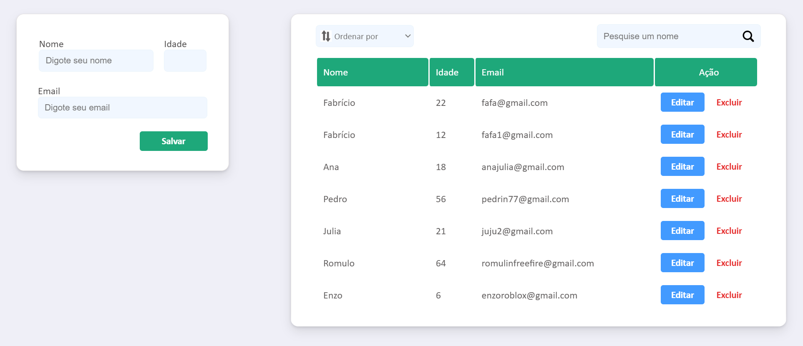

<h1 align="center">CRUD Completo 🖥️</h1>

 

<h2>Sobre o projeto 🔎</h2>
O projeto consiste em CRUD com todas as funcionalidades padrões (Create, Read, Update e Delete). Este é um projeto simples, porém importante, pois o mesmo mostra as interações das camadas no back-end e executa ações importantes no mundo web, como o consumo de rotas de uma API. Além disso, este CRUD possui interface limpa e intuitiva, além de algumas funções adcionais, detalhadas nos próximos tópicos. 
  

<h2>Tecnologias utilizadas 💻</h2>
<ul>
  <li>Java + Spring Boot;</li>
  <li>Javascript + JQuery;</li>
  <li>HTML + CSSS;</li>
  <li>Banco de dados MySQL.</li>
</ul>
 

<h2>Dependências Maven utilizadas ♦️</h2>
<ul>
  <li>Spring Web;</li>
  <li>Spring Data JPA;</li>
  <li>MySQL Driver;</li>
  <li>Lombok.</li>
</ul>
 

<h2>Recursos do site</h2>
<ul>
  <li>Inserir, vizualizar, atualizar e excluir dados de pessoas;</li>
  <li>Funcionalidades de busca, ordenação e filtração;</li>
  <li>Pequenas autenticações no momento do cadastro.</li>
</ul>
 

<h2>Passo a passo para rodar em seu PC</h2>
<ul>
  <li>Possua uma JDK 17 ou superior instalada em seu PC;</li>
  <li> Baixe ou clone o projeto em seu PC;</li>
  <li>Configure algum banco de dados MySQL, seja ele local ou de algum serviço externo (recomendo os do site RailWay) dentro do applications.properties. Para isso você precisa   do host, nome, porta, usuario e senha do banco de dados;</li>
  <li>Dê build ou compile no projeto usando alguma IDE (recomendo Intelij), para baixar todas as dependências;</li>
  <li>Por fim, dê start na classe principal do projeto (FutshopApplication) e pronto, ele já funcionará.</li>
</ul>
 

<h2>Link video 📺</h2>
https://youtu.be/6pFGh1nESVI
  

<h2>Link site :zap:</h2>
Desclupe, o site ainda não está no ar
  

<h2>Autor :raising_hand:</h2>

| [ Fabrício Ferreira Tavares](https://github.com/fabricionft) | 
| :---: | 
